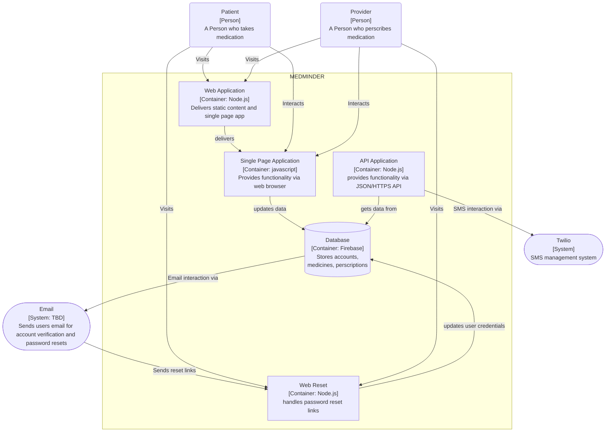
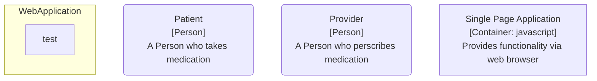
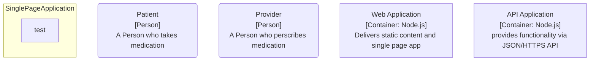
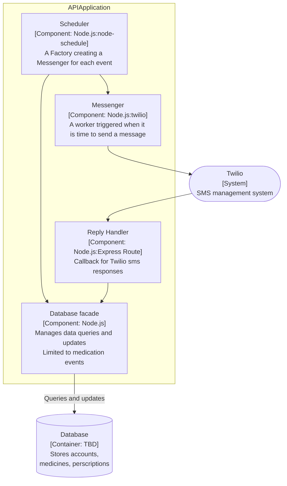
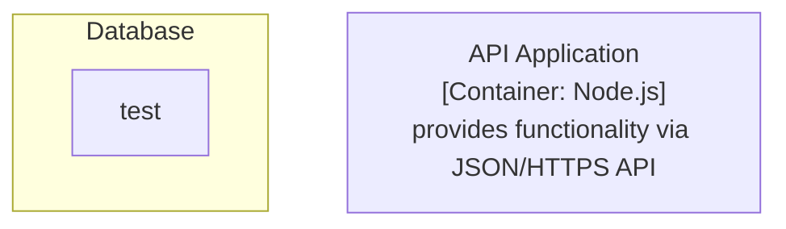

# Context Diagram
<!-- generated by mermaid compile action - START -->

  
Mermaid markup

<!-- generated by mermaid compile action - END -->

# Container Diagram
<!-- generated by mermaid compile action - START -->

  
Mermaid markup

<!-- generated by mermaid compile action - END -->

# Component
## Web Application
<!-- generated by mermaid compile action - START -->

  
Mermaid markup

<!-- generated by mermaid compile action - END -->

## Single Page Application
<!-- generated by mermaid compile action - START -->

  
Mermaid markup

<!-- generated by mermaid compile action - END -->

## API Application
<!-- generated by mermaid compile action - START -->

  
Mermaid markup

<!-- generated by mermaid compile action - END -->

## Database
<!-- generated by mermaid compile action - START -->

  
Mermaid markup

<!-- generated by mermaid compile action - END -->

## Web Reset
<!-- generated by mermaid compile action - START -->

  
Mermaid markup

<!-- generated by mermaid compile action - END -->
