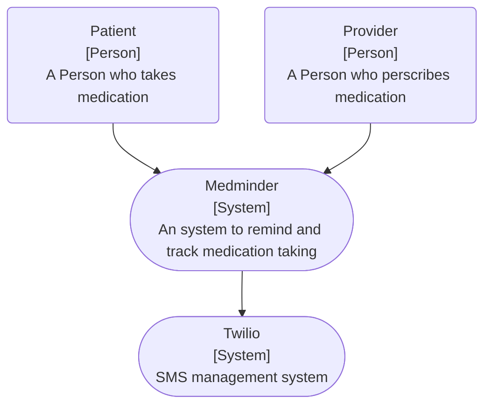
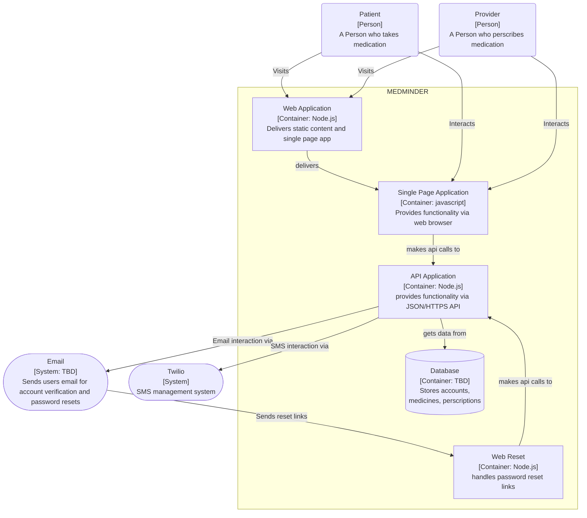
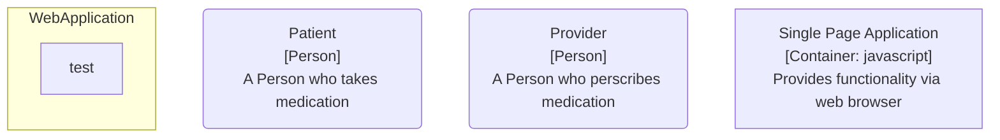
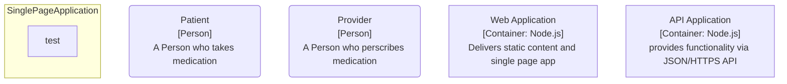
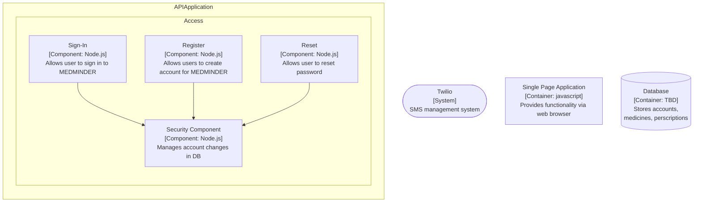
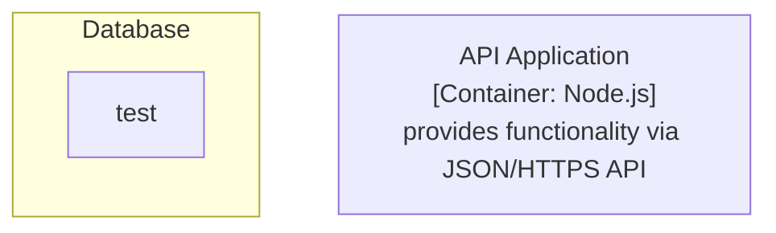

# Context Diagram

```mermaid
flowchart TB
Patient("Patient<br/>[Person]<br/>A Person who takes medication")
Provider("Provider<br/>[Person]<br/>A Person who perscribes medication")
Medminder(["Medminder<br/>[System]<br/>An system to remind and track medication taking"])
Twilio(["Twilio<br/>[System]<br/>SMS management system"])
Patient --> Medminder
Provider --> Medminder
Medminder --> Twilio
```

# Container Diagram

```mermaid
flowchart TB
Patient("Patient<br/>[Person]<br/>A Person who takes medication")
Provider("Provider<br/>[Person]<br/>A Person who perscribes medication")
Twilio(["Twilio<br/>[System]<br/>SMS management system"])
Email(["Email<br/>[System: TBD]<br/>Sends users email for account verification and password resets"])
 subgraph MEDMINDER
 	direction TB
	reset["Web Reset<br/>[Container: Node.js]<br/>handles password reset links"]
 	web["Web Application<br/>[Container: Node.js]<br/>Delivers static content and single page app"]
 	single["Single Page Application<br/>[Container: javascript]<br/>Provides functionality via web browser"]
	api["API Application<br/>[Container: Node.js]<br/>provides functionality via JSON/HTTPS API"]
	db[("Database<br/>[Container: TBD]<br/>Stores accounts,<br/>medicines, perscriptions")]
	web --> |"delivers"| single
	single --> |"makes api calls to"| api
	reset --> |"makes api calls to"| api
	api --> |"gets data from"| db
 end
Email --> |"Sends reset links"| reset
api --> |"Email interaction via"| Email
api --> |"SMS interaction via"| Twilio
Patient --> |"Visits"| web
Provider --> |"Visits"| web
Patient --> |"Interacts"| single
Provider --> |"Interacts"| single
```

# Component
## Web Application

```mermaid
flowchart TB
Patient("Patient<br/>[Person]<br/>A Person who takes medication")
Provider("Provider<br/>[Person]<br/>A Person who perscribes medication")
single["Single Page Application<br/>[Container: javascript]<br/>Provides functionality via web browser"]
  subgraph WebApplication
	direction TB
	test
  end
```

## Single Page Application

```mermaid
flowchart TB
Patient("Patient<br/>[Person]<br/>A Person who takes medication")
Provider("Provider<br/>[Person]<br/>A Person who perscribes medication")
web["Web Application<br/>[Container: Node.js]<br/>Delivers static content and single page app"]
api["API Application<br/>[Container: Node.js]<br/>provides functionality via JSON/HTTPS API"]
  subgraph SinglePageApplication
	direction TB
	test
  end
```

## API Application

```mermaid
flowchart TB
Twilio(["Twilio<br/>[System]<br/>SMS management system"])
single["Single Page Application<br/>[Container: javascript]<br/>Provides functionality via web browser"]
db[("Database<br/>[Container: TBD]<br/>Stores accounts,<br/>medicines, perscriptions")]
  subgraph APIApplication
	direction TB
	subgraph Access
		direction TB
		Signin["Sign-In<br/>[Component: Node.js]<br/>Allows user to sign in to MEDMINDER"]
		Signup["Register<br/>[Component: Node.js]<br/>Allows users to create account for MEDMINDER"]
		Reset["Reset<br/>[Component: Node.js]<br/>Allows user to reset password"]
		Security["Security Component<br/>[Component: Node.js]<br/>Manages account changes in DB"]
		Signin --> Security
		Signup --> Security
		Reset --> Security
	end
  end
```

## Database

```mermaid
flowchart TB
api["API Application<br/>[Container: Node.js]<br/>provides functionality via JSON/HTTPS API"]
  subgraph Database
	direction TB
	test
  end
```

## Web Reset

```mermaid
flowchart TB
api["API Application<br/>[Container: Node.js]<br/>provides functionality via JSON/HTTPS API"]
  subgraph Database
	direction TB
	test
  end
```
